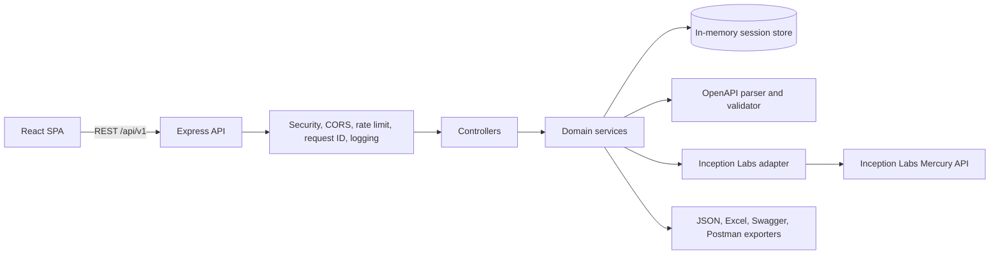
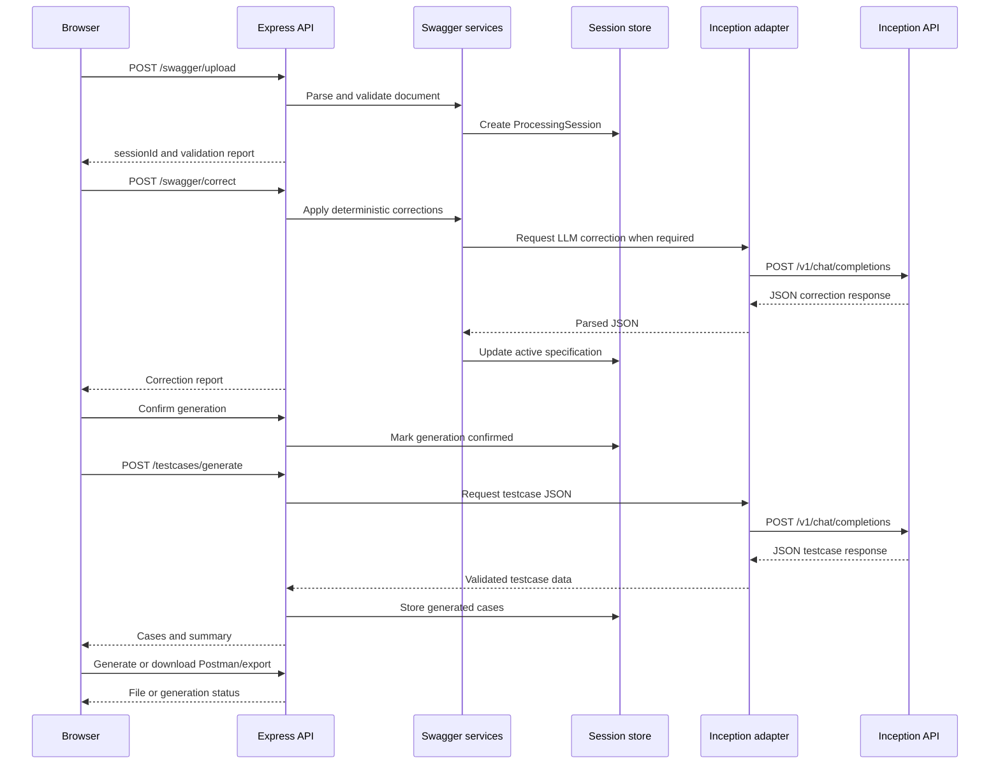

# Swagger API Testcase Generator Architecture

## 1. Purpose and Scope

The Swagger API Testcase Generator is a web application that accepts an OpenAPI or Swagger document, validates it, applies corrections, generates API test cases with Inception Labs Mercury, and exports the results.

This document describes the current source architecture, runtime boundaries, data flow, configuration, security controls, and operational constraints.

## 2. Architectural Style

The application uses a multilayered, API-based architecture with modular separation of concerns:

- A React single-page application provides the user workflow.
- An Express REST API owns validation, session state, correction, generation, conversion, and export operations.
- Services isolate business capabilities from HTTP controllers.
- Zod schemas validate external request and LLM response data at runtime.
- Inception Labs is accessed through one backend adapter and is never called directly by the browser.
- Session data is held in process memory and expires after a configured time-to-live.



## 3. Repository Structure

```text
frontend/
  src/
    App.tsx                         Application workflow state machine
    components/                     Upload, validation, testcase, branding UI
    services/api.ts                 Browser-to-backend API client
    types/index.ts                  Frontend response mirrors

backend/
  src/
    server.ts                       HTTP process entry point
    app.ts                          Express application and middleware pipeline
    routes/index.ts                 REST route registration
    controllers/                    HTTP orchestration and session checks
    services/                       Business capabilities and provider adapter
    schemas/                        Zod request and LLM output schemas
    middleware/                     Upload, tracing, and error handling
    store/                          In-memory session persistence
    types/                          Backend domain types
    config/                         Environment parsing and feature flags
    utils/                          Errors and structured logging

docs/
  backend-api.yaml                  OpenAPI description of the backend API
examples/                            Sample OpenAPI documents
```

## 4. Runtime Components

### 4.1 Frontend

The frontend is a React 19 application built with Vite.

- [main.tsx](../frontend/src/main.tsx) mounts the application.
- [App.tsx](../frontend/src/App.tsx) owns the workflow state and transitions between upload, validation, and testcase views.
- `UploadPanel` accepts YAML, YML, and JSON files through drag-and-drop or a file picker.
- `ValidationPanel` displays validation errors, warnings, and corrections.
- `TestcasePanel` filters, searches, reviews, and exports generated cases.
- [api.ts](../frontend/src/services/api.ts) is the only frontend module that calls the backend.
- Vite proxies `/api` requests to the backend during local development.

The browser never receives the Inception API key. It communicates only with the backend API.

### 4.2 Backend Bootstrap

- [server.ts](../backend/src/server.ts) starts the HTTP server, schedules expired-session cleanup every five minutes, and handles SIGTERM/SIGINT shutdown.
- [app.ts](../backend/src/app.ts) configures Express middleware and mounts the API at `/api/v1`.
- [routes/index.ts](../backend/src/routes/index.ts) defines the public API routes.

The middleware order is:

1. Request ID assignment
2. HTTP logging with Pino
3. Helmet security response headers
4. CORS validation
5. JSON body parsing with a 2 MB limit
6. Global rate limiting of 120 requests per minute
7. API route handling
8. 404 response
9. Central error handling

### 4.3 Controllers

Controllers translate HTTP requests into service calls and enforce session workflow rules.

- `swagger.controller.ts`: upload, validate, and correct specifications.
- `testcase.controller.ts`: confirm generation, generate cases, and retrieve cases.
- `session.controller.ts`: retrieve summaries and clear sessions.
- `postman.controller.ts`: generate Postman collections.
- `export.controller.ts`: stream JSON, Excel, Swagger, and Postman files.

Controllers do not contain provider protocol logic. That responsibility belongs to [llm.service.ts](../backend/src/services/llm.service.ts).

## 5. Domain Services

### OpenAPI Processing

[swagger.service.ts](../backend/src/services/swagger.service.ts) provides:

- YAML and JSON parsing.
- OpenAPI/Swagger validation through `@apidevtools/swagger-parser`.
- Custom warnings for missing operation IDs and descriptions.
- Specification serialization for export.
- Specification summary calculation.

### Correction

[correction.service.ts](../backend/src/services/correction.service.ts) uses a two-stage correction strategy:

1. Apply deterministic corrections such as missing `info` values and response descriptions.
2. If errors remain and safe-only mode is disabled, call the configured LLM.
3. Validate the resulting specification again.
4. Return a correction report with changes and remaining errors.

### LLM Integration

[llm.service.ts](../backend/src/services/llm.service.ts) is the only outbound LLM integration point.

It calls:

```text
POST https://api.inceptionlabs.ai/v1/chat/completions
```

The adapter sends:

- Bearer authentication using `INCEPTION_API_KEY`.
- `INCEPTION_MODEL`, normally `mercury-2.5`.
- System and user messages.
- JSON response format.
- Configured completion-token and reasoning-effort settings.

It also owns timeout handling, provider error conversion, empty-response detection, and JSON parsing. The returned JSON is validated by the caller using Zod.

### Testcase Generation

[testcase.service.ts](../backend/src/services/testcase.service.ts) validates LLM-generated testcases with `TestCaseOutputSchema`, deduplicates them, applies the `MAX_TEST_CASES` limit, and renumbers IDs.

Current behavior is LLM-only. If Inception is missing, unavailable, or returns invalid output, generation returns a controlled error rather than a deterministic testcase fallback.

### Postman and Export

- [postman.service.ts](../backend/src/services/postman.service.ts) converts the active OpenAPI document using `openapi-to-postmanv2` and can add basic Postman tests.
- [export.service.ts](../backend/src/services/export.service.ts) creates a styled Excel workbook and protects cells from formula injection.
- `export.controller.ts` streams generated files using attachment response headers.

## 6. End-to-End Workflow



## 7. REST API Surface

All routes are mounted under `/api/v1`.

| Method | Route | Responsibility |
|---|---|---|
| GET | `/health` | Liveness and LLM configuration status |
| POST | `/swagger/upload` | Upload, parse, validate, and create a session |
| POST | `/swagger/validate` | Revalidate the active specification |
| POST | `/swagger/correct` | Correct and revalidate the active specification |
| POST | `/sessions/:sessionId/confirm-test-generation` | Confirm the generation gate |
| POST | `/testcases/generate` | Generate and store testcases |
| GET | `/sessions/:sessionId/testcases` | Retrieve stored testcases |
| GET | `/sessions/:sessionId/summary` | Retrieve aggregate session summary |
| POST | `/postman/generate` | Generate and store a Postman collection |
| GET | `/sessions/:sessionId/export/json` | Download testcase JSON |
| GET | `/sessions/:sessionId/export/excel` | Download testcase Excel |
| GET | `/sessions/:sessionId/export/swagger` | Download the active specification |
| GET | `/sessions/:sessionId/export/postman` | Download the stored Postman collection |
| DELETE | `/sessions/:sessionId` | Delete the in-memory session |

The detailed endpoint description is maintained in [backend-api.yaml](backend-api.yaml).

## 8. Session and Data Model

The backend stores one `ProcessingSession` per uploaded document:

```text
ProcessingSession
  sessionId: UUID
  originalFileName
  inputFormat: yaml | json
  originalSpecification: JsonObject
  activeSpecification: JsonObject
  correctedSpecification?: JsonObject
  validationReport?: ValidationReport
  correctionReport?: CorrectionReport
  testGenerationConfirmed: boolean
  testCases: ApiTestCase[]
  generationSource?: string
  generationModel?: string
  postmanCollection?: JsonObject
  createdAt: Date
  expiresAt: Date
```

The store is implemented by [session.store.ts](../backend/src/store/session.store.ts) using a JavaScript `Map`.

- Reads lazily remove expired sessions.
- A periodic cleanup removes expired entries.
- Sessions are lost when the process restarts.
- Sessions are not shared between multiple backend instances.

## 9. Type and Validation Boundaries

The application has three type layers:

1. Backend TypeScript domain types in [backend/src/types/index.ts](../backend/src/types/index.ts).
2. Backend runtime Zod schemas in `backend/src/schemas`.
3. Frontend TypeScript mirrors in [frontend/src/types/index.ts](../frontend/src/types/index.ts).

OpenAPI and Postman documents use flexible JSON object types because their structures are dynamic. Semantic OpenAPI validation is delegated to `swagger-parser`.

LLM responses are untrusted external data. They must pass the relevant Zod schema before becoming application data.

The frontend and backend currently maintain separate type definitions. They are not generated from [backend-api.yaml](backend-api.yaml), so contract drift is possible.

## 10. Security and Reliability Controls

Current controls include:

- Helmet response security headers.
- CORS restricted by `CORS_ORIGIN`.
- Global request rate limiting.
- File extension and file-size validation.
- Request IDs for tracing.
- Structured Pino logging.
- Authorization header and API-key redaction in logs.
- Zod validation for request bodies and LLM output.
- Excel formula-injection protection.
- LLM timeout and controlled provider errors.
- No LLM credentials in frontend code.

Important limitations:

- There is no user authentication or session ownership check. A valid session UUID is sufficient to access session operations.
- The API key must be supplied through a secret manager or protected environment configuration in deployed environments. Never document or commit the key value.
- In-memory storage is unsuitable for high availability or horizontal scaling.

## 11. Configuration

Configuration is parsed and validated in [environment.ts](../backend/src/config/environment.ts).

| Variable | Purpose | Default |
|---|---|---|
| `PORT` | Backend listening port | `4000` |
| `CORS_ORIGIN` | Allowed frontend origins | `http://localhost:5173` |
| `MAX_FILE_SIZE_MB` | Uploaded specification limit | `5` |
| `SESSION_TTL_MINUTES` | Session lifetime | `60` |
| `INCEPTION_API_KEY` | Inception Labs credential | None |
| `INCEPTION_BASE_URL` | Inception API base URL | `https://api.inceptionlabs.ai/v1` |
| `INCEPTION_MODEL` | Mercury chat model | `mercury-2.5` |
| `INCEPTION_TIMEOUT_MS` | Provider request timeout | `60000` |
| `INCEPTION_MAX_COMPLETION_TOKENS` | LLM completion budget | `8000` |
| `INCEPTION_REASONING_EFFORT` | Optional reasoning level | None |
| `MAX_TEST_CASES` | Maximum generated cases | `50` |

The current local `.env` is intentionally not reproduced here because it contains credentials.

## 12. Build and Runtime Topology

Local development runs two processes:

```text
Frontend Vite server:  http://localhost:5173
Backend Express API:  http://localhost:4000
```

The frontend Vite proxy forwards `/api` to the backend. The backend then makes outbound HTTPS requests to Inception Labs.

Build commands:

```powershell
Push-Location backend
npm run build
Pop-Location

Push-Location frontend
npm run build
Pop-Location
```

The backend production entry point is `dist/server.js`. The frontend production output is generated under `frontend/dist`.

## 13. Architectural Constraints and Risks

1. **Process-local state:** restarting or scaling the backend loses or fragments active sessions.
2. **Session bearer access:** session IDs currently act as access tokens without authentication.
3. **Provider coupling:** the adapter isolates transport concerns, but provider names still appear in configuration, health metadata, and UI labels.
4. **Contract duplication:** frontend types, backend types, and the OpenAPI document can drift.
5. **LLM dependence:** testcase generation requires a configured and available Inception model.
6. **Prompt-sized requests:** the entire specification is sent in the LLM user prompt; large specifications may hit provider context or request limits.
7. **Limited automated coverage:** provider failures, export behavior, and end-to-end workflows should have focused automated tests.
8. **Documentation drift:** generated or manually maintained files should be updated whenever routes, provider behavior, or response envelopes change.

## 14. Recommended Evolution

For production hardening, prioritize the following order:

1. Rotate any exposed API keys and use a deployment secret manager.
2. Add authentication and session ownership authorization.
3. Move sessions to Redis or a durable database if restart recovery or horizontal scaling is required.
4. Generate shared frontend/backend contracts from the API schema or publish a shared TypeScript package.
5. Add adapter contract tests with mocked Inception responses.
6. Add integration tests for upload, correction, generation, Postman conversion, and exports.
7. Add request-size and context-size protections for large OpenAPI documents.
8. Add provider observability for latency, status codes, token usage, and rate limits without logging prompts or secrets.

## 15. Source of Truth

For implementation behavior, prefer the current TypeScript source under `backend/src` and `frontend/src`.

Use [backend-api.yaml](backend-api.yaml) for the intended REST contract, but verify response details against controller implementations because the document currently contains mostly endpoint-level descriptions rather than complete response schemas.
